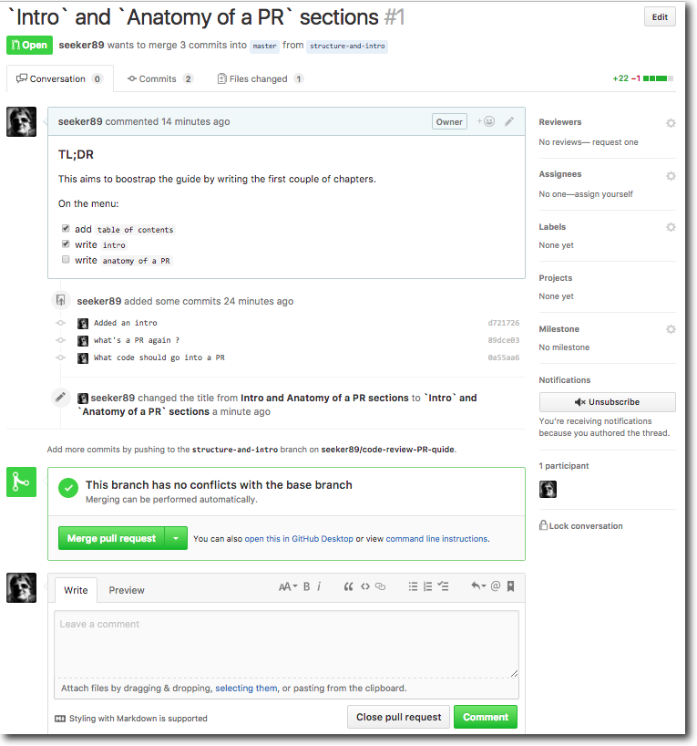

# Code Reviews with PRs Guide

### TL;DR

This guide guide is for people who'd like to spread good code review practices in their teams.

It aims to be a reference to show to your people, along with some good examples.

It takes elements from both [this post on github blog](https://github.com/blog/1943-how-to-write-the-perfect-pull-request) and [the thoughtbot guide](https://github.com/thoughtbot/guides/tree/master/code-review).

## Table of contents

- [Intro](#intro)
- [Anatomy of a PR](#anatomy-of-a-pr)
- [How to review other people's code](#how-to-review-other-peoples-code)
- [How to receive criticism and be more awesome](#how-to-receive-criticism-and-be-more-awesome)
- [Tips and tricks](#tips-and-tricks)
- [Good examples](#good-examples)
- [Bad examples](#bad-examples)
- [Glossary](#glossary)
- [Good resources](#good-resources)

## Intro

This guide is best suited for companies/teams using `github` or `github entreprise` to manage their code and code reviews, but the same principles apply elsewhere. 

It will try to explain the best practices on creating PRs, reviewing them, common ways of doing things, the `do`s and `don't`s, and we will cover the :shipit: squirrel.

## Anatomy of a PR

### What's a PR again ?

__PR__ is a `github`-specific concept which means `pull request`. You can [read on the official docs with plenty of screenshots](https://help.github.com/articles/about-pull-requests/), but essentially, 

> __PR is an UI for merging changes from one branch to another__, that allows discussion, pasting silly gifs, commenting on particular lines, and by doing that, documenting the change and the thinking behind for later (think onboarding a new person, or just refreshing your own memory).

The looks something like this one this one:

### What code should go into a PR ?

The scope of a __PR__ will depend vastly on the actual changes that you are implementing, the project etc, but here are some guidelines:

#### Good PR

- bundles together __changes which are truly connected__
- __says exactly what it does__ on the tin
- __contains enough info for someone new to pick it up later__ and understand what's going on
- contains a __healthy dose of self-distance__
- makes use of the all the goodies available (lists, screenshots, links, etc).

#### Bad PR

- has __no description and/or uninformative title__
- __does more or less than it says on the tin__
- handles __issues which are unrelated__

### Building blocks of a PR

#### A branch. A good one.

__PR__ s are made by taking a branch, that you want to merge into another one. So for a good __PR__, you need a good branch discipline.

This is going to depend on the dynamics between the team members, but again, here's some stuff that tends to work well:

- __give the branch a reasonable name.__ Some common practices include adding prefixes, for example:
 - `fix/stale-connections-to-db`
 - `feature/add-paging`
 - `experiment/reimplement-proxy-in-go`
- __remove the branch after the PR is merged in__ (click the button at the bottom of the __PR__)
- __commit the changes in small, easily reversible increments__
- __apply logic and behave your best__

#### Description

Descriptions are written in Markdown, so they support all the goodies, like lists, code blocks, quotes, links, inline images, emojis, headers, etc. __Use them__.

> A __good description__ is one that you can dig out 6 months later, read, and:
- understand __why the change was needed__, 
- see clearly __what were the difficulties__,
- understand __what decisions were made and why__,
- and know __how to verify that it works__.

#### Dialogue

Reviewing other people's code doesn't have to be boring, and __the review shouldn't take more than 30 minutes__ (including checking out the code, running the tests and playing around). If it does, your __PR__ is probably too big.

Don't think I'm a nerd, but with a good use of [gifs](http://giphy.com/) and the `` inline image tag, they can be really fun.

## How to review other people's code

## How to receive criticism and be more awesome

## Tips and tricks

## Good examples

## Bad examples

Just kidding :smiley:. We won't be digging them out from the lurky search engine results... Or will we ?

## Glossary

## Good resources

- [https://github.com/thoughtbot/guides/tree/master/code-review](https://github.com/thoughtbot/guides/tree/master/code-review)
- [https://github.com/blog/1943-how-to-write-the-perfect-pull-request](https://github.com/blog/1943-how-to-write-the-perfect-pull-request)
